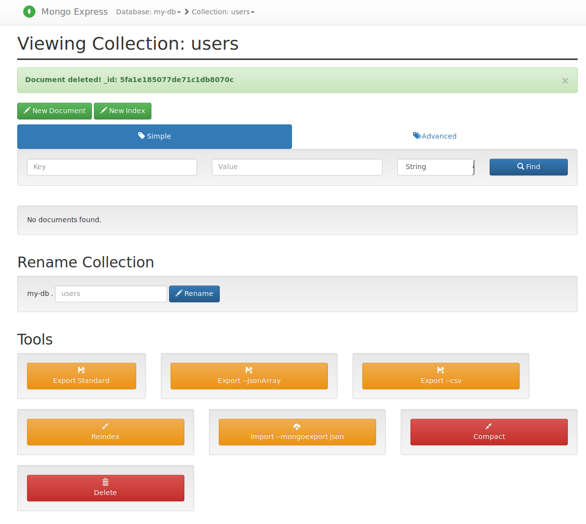
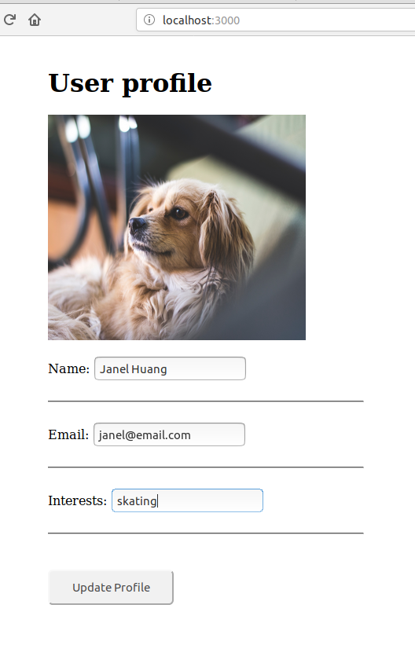

# Building_Conainters
Followed https://www.youtube.com/watch?v=wH9XesmPUOk&amp;list=PLy7NrYWoggjzfAHlUusx2wuDwfCrmJYcs&amp;index=3 
for a tutorial on building containers

# Containers Overview
Containers are a way to package applications with all the necessary data. It is a method of OS virtualization. Containers run on dockers which is a software platform that enables building, testing and deployment of applications quickly. Note that the difference between an image and a container is that the image is not running and movable whereas a container is a running image. The difference between a conatiner and VM is that the VM runs on a hypervisor and provides an abstract machine whereas a container provides an abstract of an OS. 

## Container Development Benefits
Before containers: Services will need to be installed individually on each OS (e.g. mac/windows/linux). This increases the steps and human errors possible when installing.
After containers: All configurations and applications are stored in a single container, only requires a 1 command to install. 

## Container Deployment Benefits 
Before containers: Configuration of servers requires understanding of dependancy versions. There could also be miscommunications between the developers adn the operations team.
After containers: No environment configuration on servers except the docker image.

## Benefits
* Repeatable
* Self-contained execution environments
* Software can run in different environments
* Faster to launch, stop or terminate than VMs
* Highly scalable and fast 
* Orchestrates the execution of Docker containers
* Removes complex onstanding infrastructure

# Part 1: Basic Docker Commands
* pull - gets an image
* run - runs an image. Use -d for running in detached mode (in the background). Note that if the image is not found locally, it does the pull command automatically. Use --name for adding a name to the container. Name could be used interchangably with the container id. 
* ps - lists the running images. Use -a to list all running and not running containers
* stop <container_id> - stops the container
* start <container_id> - restarts a stopped container
* images - list the images 

# Part 2: Advanced Docker Commands
* -p<host_port>:<container_port> -Binds a host port to a container port. This is useful if you have 2 of the same services running on the same port. 

# Part 3: Debugging
* logs <container_id> - gets the log files of the container
* exec -it <container_id> /bin/bash - opens a terminal in the container. Note that the 'it' stands for iteractive terminal. 

# Part 4: Building a web application with mongodb using containers
## Useful Commands
* network ls - lists the newtorks in docker

## Staring the mongodb
docker run -p27017:27017 -d -e MONGO_INITDB_ROOT_USERNAME=admin -e MONGO_INITDB_ROOT_PASSWORD=password --name mongodb --net mongo-network mongo

## Starting the mongo-express
docker run -d -p 8081:8081 -e ME_CONFIG_MONGODB_ADMINUSERNAME=admin -e ME_CONFIG_MONGODB_ADMINPASSWORD=password --net mongo-network --name mongo-express -e ME_CONFIG_MONGODB_SERVER=mongodb mongo-express

## Connect to MongoDB and add new DB and Collection
1. Connect to the MongoDB: In web browser enter: localhost:8081
2. Create a new database
3. Click on the database and create a new collection called users
The resulting database and collection should be as follows

## Run the node JS web application and a new entry
1. npm install
2. node server.js
3. In web browser: localhost:3000
4. Click on edit profile and change the profile entries
5. Refresh the mongo db collections page to see if the new entry has been added

